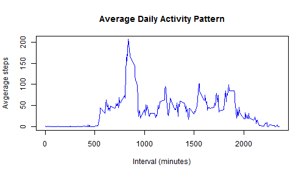

## Loading and preprocessing the data


```r
if(!file.exists("activity.csv")) {
  unzip("activity.zip")
}
data <- read.csv("activity.csv")
```


## What is mean total number of steps taken per day?

```r
library(plyr)
```

```
## Warning: package 'plyr' was built under R version 3.0.3
```

```r
dtSummary <- ddply(data,~date,summarize, sumSteps =sum(steps, na.rm=TRUE))
hist(dtSummary$sumSteps, breaks=10, main="Histogram of Total steps taken per day" , xlab="Steps")
```

 

```r
mean = mean(dtSummary$sumSteps, na.rm=TRUE)
median = median(dtSummary$sumSteps, na.rm=TRUE)
```

Mean of total number of steps taken per day is **9354.2295082** and median is **10395**.


## What is the average daily activity pattern?

```r
dtDailyPattern <- ddply(data,~interval,summarize, avgSteps =mean(steps, na.rm=TRUE))
plot(dtDailyPattern$interval,dtDailyPattern$avgSteps, type="l", pch=19,col="blue",
     main= "Average Daily Activity Pattern",
     xlab="Interval (minutes)", 
     ylab="Avgerage steps" );
```

 

```r
maxInterval = dtDailyPattern[dtDailyPattern$avgSteps == max(dtDailyPattern$avgSteps),1]
```

Interval of **835** minutes in the day contains maximum number of steps averaged across all days.


## Imputing missing values

```r
lenNA = length(is.na(data$steps))
```
Total number of missing values in the dataset are **17568**

Now we will fill missing values with correponding 5 min average steps across days


```r
#merge with 5 min average daily steps
dtMerge <- merge(data,dtDailyPattern,by="interval")     

#fill NA's with average steps
dtMerge$steps[is.na(dtMerge$steps)] <- dtMerge$avgSteps[is.na(dtMerge$steps)]

dtSummary2 <- ddply(dtMerge,~date,summarize, sumSteps =sum(steps, na.rm=TRUE))
hist(dtSummary2$sumSteps, breaks=10, main="Histogram of Total steps taken per day" , xlab="Steps")
```

 

```r
mean2 = mean(dtSummary2$sumSteps, na.rm=TRUE)
median2 = median(dtSummary2$sumSteps, na.rm=TRUE)
```

Mean of total number of steps taken per day after filling missing values is **1.0766189 &times; 10<sup>4</sup>** and median is **1.0766189 &times; 10<sup>4</sup>**. 
There is increase in mean and median values from the first part of the assignment.
There  is also increase in total number of daily steps.


## Are there differences in activity patterns between weekdays and weekends?

Creating factor variable "weekday" and "weekend".


```r
dtMerge$day <- weekdays(as.Date(dtMerge$date))
dtMerge$day <- ifelse(dtMerge$day %in% c("Sunday","Saturday"),"weekend","weekday")
dtMerge$day <- as.factor(dtMerge$day)
```

Creating a plot of 5-minute interval (x-axis) and the average number of steps taken, averaged across all weekday days or weekend days (y-axis).


```r
dtSummary3 <- ddply(dtMerge,c("interval","day"),summarize, avgSteps =mean(steps, na.rm=TRUE))
library(ggplot2)
```

```
## Warning: package 'ggplot2' was built under R version 3.0.3
```

```r
g <- ggplot(dtSummary3, aes(interval,avgSteps))
g + geom_line(aes(color = day)) +  
  facet_grid(day~.) + 
  labs(x = "Inerval", y = "Number of steps")
```

 


